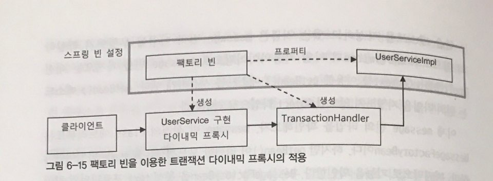

## 6.3.4 다이내믹 프록시를 위한 팩토리 빈
- TransactionHandler와 다이내믹 프록시를 DI를 통해 사용할 수 있도록 만들어보자.
- 스프링의 경우 클래스 이름과 프로퍼티로 리플랙션 API를 이용해 새로운 오브젝트를 만든다.
```
Date now = (Date) Class.forName("java.util.Date").newInstance();
```
- 하지만 다이내믹 프록시 오브젝트는 클래스가 무엇인지 알 수 없고 Proxy 클래스의 newProxyInstance()라는 스태틱 팩토리 메소드로만 생성이 가능하다.
- 스프링은 클래스 정보를 가지고 디폴트 생성자를 통해 오브젝트를 만드는 방법 외에도 빈을 만들 수 있는 방법을 제공한다.

### 팩토리 빈
- 스프링을 대신하여 오브젝트의 생성 로직을 담당한다.
- 가장 기본적인 팩토리 빈을 만드는 방법은 FactoryBean이라는 인터페이스를 구현하는 것이다.

```
package org.springframework.beans.factory;

public interface FactoryBean<T> {
	T getObject() throws Exception; // 오브젝트 생성 및 반환
	Class<? extends T> getObjectType()
	boolean isSingleton();
}
```

#### 예제
- 다음과 같이 생성자를 통해 만들 수 없으며 반드시 스태틱 메소드를 사용해야하는 Message 클래스에 대한 빈팩토리를 만들어보자.
```
public class Message {
	String text;

	private Message(String text) {
		this.text = text;
	}

	public String getText() {
		return text;
	}

	public static Message newMessage(String text) {
		return new Message(text);
	}
}
```
- 생성자가 private인데도 불구하고 다음과 같이 일반적인 방법으로 빈을 생성하고자 하면 리플랙션을 통해 생성은 된다. 하지만 정상 작동이 안될 가능성이 높기 때문에 바람직하지 못하다.
```
<bean id="m" class="springbook.learningtest.spring.factorybean.Message">
```
- 대신, 팩토리 빈을 구현해보자.
```
public class MessageFactoryBean implements FactoryBean<Message> {
	String text;

	// 프로퍼티를 팩토리 빈이 대신 DI 받아서 오브젝트 생성 시 사용한다.
	public void setText(String text) {
		this.text = text;
	}

	// 코드로 직접 생성 및 초기화를 한다.
	public MEssage getObject() throws Exception {
		return Message.newMessage(this.text);
	}

	public Class<? extends Message> getObjectType {
		return Message.class;
	}

	public boolean isSingleton() {
		return false;
	}
}
```
- 팩토리 빈은 빈 오브젝트 생성 시에만 사용이 되고 getObject로 생성된 빈을 가져다 쓰면 된다.

### 팩토리 빈의 설정 방법
```
<bean id="message"
	class="springbook.learningtest.spring.factorybean.MessageFactoryBean">
	<property name="text" value="Factory Bean" />
</bean>
```
- id와 class 애트리뷰트를 설정한다는 면에서 다른 빈 설정들과 다를게 없어보인다. 다른 점이 있다면 이 빈의 오브젝트 타입은 명시해놓은 MessageFactoryBean이 아닌 MessageFactoryBean의 getObjectType가 반환한 Message 클래스이다.
```
@RunWith(SpringJUnit4ClassRunner.class)
@ContextConfiguration
public class FactoryBeanTest {
	@Autowired
	ApplicationContext context; // 빈 타입이 모르므로 ApplicationContext와 getBeans()를 이용한다.

	@Test
	public void getMessageFromFactoryBean() {
		Object message = context.getBean("message"); // getBean()은 클래스를 지정하지 않으면 Object로 반환한다.
		assertThat(message, is(Message.class));
		assertThat(((Message)message).getText(), is("Factory Bean"));
	}

	@Test
	public void getFactoryBean() {
		Object message = context.getBean("&message"); // &를 붙이면 팩토리 빈 자체를 가져온다.
		assertThat(message, is(MessageFactoryBean.class));
	}
	
}
```

### 다이내믹 프록시를 만들어주는 팩토리 빈

```
package springbook.user.service;

public class TxProxyFactoryBean implements FactoryBean<Object> {
	// TransactionHandler 생성 시 필요한 값들.
	Object target;
	PlatformTransactionManager transactionManager;
	String pattern;
	// 다이내믹 프록시 생성 시 필요한 값.
	Class<?> serviceInterface;

	public void setTarget(Object target) {
		this.target = target;
	}

	public void setTransactionManager(PlatformTransactionManager transactionManager) {
		this.transactionManager = transactionManager;
	}

	public void setPattern(String pattern) {
		this.pattern = pattern;
	}

	public void setServiceInterface(Class<?> serviceInterface) {
		this.serviceInterface = serviceInterface;
	}

	// FactoryBean 인터페이스 구현 메소드
	// DI 받은 정보로 TransactionHandler를 사용하는 다이내믹 프록시를 생성.
	public Object getObject() throws Exception {
		TransactionHandler txHandler = new TransactionHandler();
		txHandler.setTarget(target);
		txHandler.setTransactionManager(transactionManager);
		txHandler.setPattern(pattern);
		return Proxy.newProxyInstance(getClass().getClassLoader(),
				new Class[] { serviceInterface }, txHandler);
	}

	public Class<?> getObjectType() {
		return serviceInterface; // DI 받은 인터페이스 타입에 따라 생성 오브젝트 타입이 바뀐다.
	}

	public boolean isSingleton() {
		return false; // 매번 같은 오브젝트를 리턴하지 않는다.
	}
}
```
```
<bean id="userService" class="springbook.user.service.TxProxyFactoryBean">
	<property name="target" ref="userServiceImpl" /> // 다른 빈
	<property name="transactionManager" ref="transactionManager" /> // 다른 빈
	<property name="pattern" value="upgradeLevels" /> // 문자열
	<property name="serviceInterface" value="springbook.user.service.userService" /> // 클래스 또는 인터페이스
</bean>
```

### 트랜잭션 프록시 팩토리 빈 테스트
```
public class UserServiceTest {
	@Autowired
	ApplicationContext context;
	...
	@Test
	@DirtiesContext
	public void upgradeAllOrNothing() throws Exception {
		TestUserService testUserService = new 
			TestUserService(users.get(3).getId());
		testUserService.setUserDao(userDao);
		testUserService.setMailSender(mailSender);
		
		ProxyFactoryBean txProxyFactoryBean = context.getBean("&userService", ProxyFactoryBean.class);
		txProxyFactoryBean.setTarget(testUserService); // 테스트 타깃을 주입한다.
		// 변경된 타깃 설정을 이용해 다이내믹 프록시 오브젝트를 생성한다.
		UserService txUserService = (UserService) txProxyFactoryBean.getObject();

		userDao.deleteAll();
		for (User user : users) userDao.add(user);

		try {
			txUserService.upgradeLevels();
			fail("TestUserServiceException expected");
		} catch (TestUserServiceException e) {
		}
		checkLevel(users.get(1), false);
	}
```

## 6.3.5 프록시 팩토리 빈 방식의 장점과 한계
### 프록시 팩토리 빈의 재사용
```
<bean id="coreService" class="complex.module.coreServiceImpl">
	<property name="coreDao" ref="coreDao" />
</bean>
```
- coreService라는 임의의 서비스에 트랜잭션을 추가하고 싶을 땐 위의 설정을 아래의 설정과 같이 바꿔주기만 하면 된다.
```
<bean id="coreServiceTarget" class="complex.module.coreServiceImpl">
	<property name="coreDao" ref="coreDao" />
</bean>
```
```
<bean id="coreService" class="springbook.user.service.TxProxyFactoryBean">
	<property name="target" ref="coreServiceTarget" />
	<property name="transactionManager" ref="transactionManager" />
	<property name="pattern" value="" />
	<property name="serviceInterface" value="complex.module.coreServiceImpl" /> 
</bean>
```


### 프록시 팩토리 빈 방식의 장점
- 프록시의 단점은 프록시를 적용할 대상이 구현하고 있는 인터페이스를 구현하는 프록시 클래스를 모두 구현해야 한며 그에 따라 중복 코드가 많아진다.
- 다이내믹 프록시 타깃 인터페이스를 구현하는 클래스를 모두 만들 필요가 없으며 하나의 메소드 핸들러 구현으로 여러 개의 메소드에 부가기능을 추가할 수 있다. 그리고 DI를 이용하면 다이내믹 프록시 생성도 생략할 수 있으며 다양한 타깃 오브젝트에도 적용이 가능하다.

### 프록시 팩토리 빈의 한계
- 하나의 클래스 안에 존재하는 여러개의 메소드에 부가기능을 제공하는 것은 쉬우나 여러 클래스에 공통적인 부가기능을 제공하려면 팩토리 빈 설정이 중복된다.
- 하나의 타깃에 여러 부가기능을 제공하려고 할 때도 중복 코드가 나올 수 밖에 없다.
- TransactionHandler가 타깃 오브젝트를 프로퍼티로 갖고 있어 프록시 팩토리 빈 갯수만큼 생성된다.


