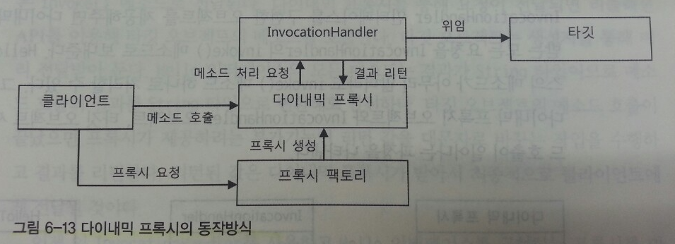

#6.3 다이내믹 프록시와 팩토리빈
##6.3.1 프록시와 프록시 패턴 데코레이터 패턴
* 프록시 : 클라이언트가 사용하려고 하는 실제 대상인 것처럼 위장해서 클라이언트의 요청을 받아주는 것을 대리인역할  

### 데코레이터 패턴
* 데코레이터 패턴 : 타킷에 부가적인 기능을 런타임시 다이내믹하게 부여해주기 위해 프록시를 사용하는 패턴
                컴파일 시점 즉 코드상에서는 어떤 방법과 순서로 프록시와 타깃이 연결되어 사용되는지 정해지지 않음
     

                
### 프록시 패턴
* 일반적 용어 프록시 : 사용 대상 사이에 대리 역할을 맡은 오브젝트
* 프록시 패턴 : 프록를 사용하는 방법 중 타킷에 대한 접근 방법을 제어하려는 목적을 가진 경우
 -> 타킷 오브젝트에 대한 레퍼런스가 미리 필요할 경우 적용
 -> 클라이언트에게 타킷에 대한 레퍼런스를 넘겨야 하는데 실제 타킷 오브젝트를 만드는 대신 프록시를 넘겨주는 것 
 
##6.3.2 다이내믹 프록시

### 프록시의 구성과 프록시 작성의 문제점

* 프록시 기능
    - 타깃과 같은 메소드를 구현하고 있다가 메소드가 호출되면 타깃 오브젝트로 위임
    - 지정된 요청에 대해서 부가기능 수행

``````
    public class UserServiceTx implements UserService{
        UserService userService ;   -> 타깃 오브젝트
        ...
        public void add(User user) {
            this.userService.add(user); -> 메소드 구현과 위임
        }
        
        public void upgradeLevels(){
        
        TransactionStatus status = this.transactionManager
            .getTransaction(new DefaultTransactionDefinition()); 
            try{
                userService.upgradeLevels(); -> 위임
                this.transactionManager.commit(status);
            }catch{
                this.transactionManager.rollback(status); -> 부가기능 수행
                throw e;
            }
        }
}
``````
* 위 코드의 문제점 및 해결방안
    - 타깃의 인터페이스를 구현하고 위임하는 코드를 작성하기 번거롭다 => 다이나믹 프록시 적용 
    - 부가 기능 코드가 중복 될 가능성이 높다 => 코드 분리를 통한 해결
    
### 리플렉션
 -  다이내믹 프록시는 리플렉션 기능을 이용해서 프록시를 만들어준다 리플렉션은 자바의 코드 자체를 추상화해서 접근하도록 만든 것이다
### 프록시 클래스
- 프록시 클래스
 ```` 
    public class HelloUppercase implements Hello{
        Hello hello;
        
        public HelloUppercase(Hello hello){
            this.hello = hello;
        }
        
        public String sayHello(String name){
            return hello.sayHello(name).toUpperCase();
        }
        
        public String sayThankYou(String name){
            return hello.sayThankYou(name).toUpperCase();
        }
    }
 ````
### 다이내믹 프록시 적용
  
- 다이나믹 프록시는 프록시 팩토리에 의해 런타임 시 다이내믹하게 만들어지는 오브젝트이다

### 다이내믹 프록시의 확장
``````
    public class UppercaseHandler implements InvocationHandler{
        Object target;
        private UppercaseHandler(Object target){
            this.target = target;
        }
        
     public object invoke(Object proxy, Method method, Object[] args)
        throws Throwable{
            Object ret = method.invoke(target, args);
            if(ret instanceof String){
                return ((String)ret).toUpperCase();
            }
            else{
                return ret;
            }
        
        }
    }
``````