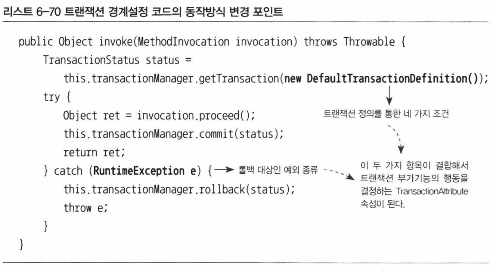
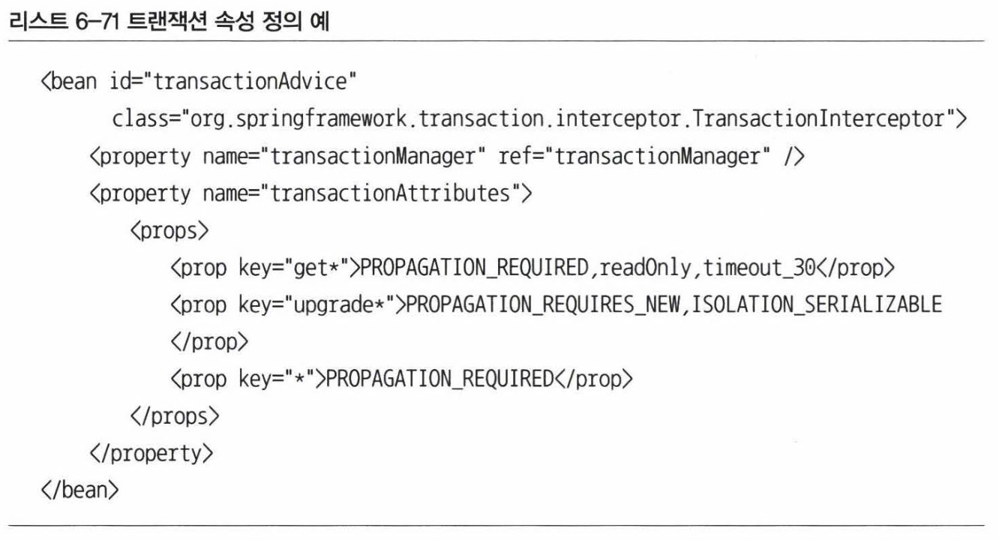
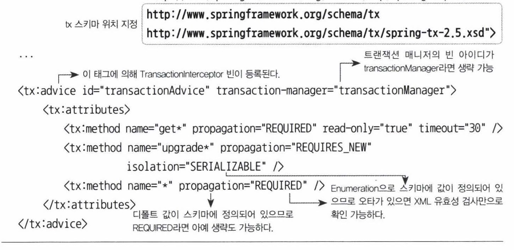

# 6.6 트랜잭션 속성
- `PlatformTransactionalManager`로 대표되는 스프링 트랜잭션 추상화를 설명하며 `DefaultTransactionDefinition` 설명을 어물쩡 넘어갔다.
- 트랜잭션을 가져올 때(?) 트랜잭션 매니저에게 전달하는 `DefaultTransactionDefinition` 의 용도를 알아보자.

## 트랜잭션 정의
- 트랜잭션이 쪼갤 수 없는 최소 단위 작업이란 개념은 항상 유효하지만, 성공(commit)과 실패(rollback) 외에도 동작 방식을 제어할 수 있는 몇 가지 조건이 있다.
- DefaultTransactionDefinition 이 구현하고 있는 TransactionDefinition 인터페이스는 트랜잭션 동작 방식에 영향을 줄 수 있는 네가지 속성을 정의하고 있다.

### 트랜잭션 전파
- 트랜잭션 전파(transaction propagation)란 트랜잭션의 경계에서 이미 진행중인 트랜잭션이 있을 때 또는 없을 때 어떻게 동작할 것인가를 결정하는 방식을 말한다.

```
+---------------+               +---------------+
|       A       |               |       B       |
+---------------+               +---------------+
| 트랜잭션 시작 |   +---------> | 트랜잭션 시작 |
|               |   |           |               |
|               +---+           |               |
| B 호출        |               |               |
|               | <--------+    |               |
|               |          |    |               |
| 트랜잭션 종료 |          +----+ 트랜잭션 종료 |
+---------------+               +---------------+
```

속성명 | 설명
------ | ----
PROPAGATION_REQUIRED | 기본 속성으로, 진행중인 트랜잭션이 있으면 참여하고 없으면 새로 시작한다. 다른 트랜잭션 경계가 설정된 메소드와 다양한 방식으로 결합해서 하나의 트랜잭션 코드로 구성하기 쉽다.
PROPAGATION_REQUIRES_NEW | 항상 새로운 트랜잭션을 시작한다. 독립적인 트랜잭션 보장이 필요할 때 적용한다.
PROPAGATION_NOT_SUPPORTED | 트랜잭션 없이 동작하며 진행중인 트랜잭션이 있어도 무시한다. 보통 AOP 모든 대상을 적용하고 예외를 두고 싶을 때 사용한다.

- 앞서 트랜잭션을 가져온다고 표현한 것은 항상 트랜잭션이 새로 시작되는건 아니기 때문이다.


### 격리수준
- 모든 트랜잭션은 격리수준(isolation level)을 가져야 한다. 가능하면 모든 트랜잭션이 순차적으로 실행돼 독립적이면 좋겠지만 성능 저하가 생기게 된다. 문제가 생기지 않는 범위에서 동시에 실행되도록 해야하는데, DefaultTransactionDefinition 에 설정된 격리수준은 ISOLATION_DEFAULT 로 DataSource 의 디폴트 설정을 따른다는 의미이다.

### 제한시간
- 트랜잭션을 수행하는 제한시간(timeout) 설정으로 기본 설정은 제한시간이 없는 것이다.

### 읽기전용
- 읽기전용(read only)로 설정하면 트랜잭션 내에서 데이터 조작을 막아줄 수 있고 데이터 엑세스 기술에 따라 성능이 향상될수도 있다.


## 트랜잭션 인터셉터와 트랜잭션 속성
- DefaultTransactionDefinition 대신 외부에서 정의한 TransactionDefinition 을 주입해주면 트랜잭션의 속성을 바꿀 수 있지만 일부 메소드만 독자적인 트랜잭션을 적용할 순 없다.
- 메소드별로 다른 트랜잭션 정의를 적용하려면 어드바이스의 기능을 확장해야 한다.

### TransactionInterceptor
- 스프링이 제공하는 TransactionInterceptor 는 앞서 사용해온 TransactionAdvice 와 유사하나 편리하게 트랙잭션 경계설정 어드바이스로 사용할 수 있게 해준다.
- TransactionInterceptor 는 PlatformTransactionalManager 와 Properties 타입(transactionAttributes)의 두가지 프로퍼티를 갖는데, transactionAttributes는 TransactionDefinition의 네 가지 기본 항목에 어떤 예외가 발생하면 롤백을 할 것인가를 결정하는 rollbackOn()이라는 메서드를 하나 더 갖고 있는 TransactionAttribute 인터페이스로 정의된다.
- 이 TransactionAttribute를 이용하면 트랜잭션 부가기능의 동작 방식을 모두 제어할 수 있다.



- TransactionAdvice는 RuntimeException이 발생하는 경우에만 트랜잭션을 롤백시킨다. 하지만 런타임 예외가 아닌 경우에는 트랜잭션이 제대로 처리되지 않고 메서드를 빠져나가게 되어 있다.
- 그렇다면 런타임 예외만이 아니라 모든 종류의 예외에 대해 트랜잭션을 롤백 시키도록 해야 할까? 2장에서 설명했듯이 일부 체크 예외는 정상적인 작업 흐름 안에서 사용될 수도 있다.
- 그래서 TransactionAttribute는 rollbackOn()이라는 속성을 둬서 기본 원칙과 다른 예외처리가 가능하게 해준다. 이를 활용하면 특정 체크 예외의 경우는 트랜잭션을 롤백시키고, 특정 런타임 예외에 대해서는 트랜잭션을 커밋시킬 수도 있다.
- TransactionInterceptor는 이런 TransactionAttribute를 Properties라는 일종의 맵 타입 오브젝트로 전달받는다.


### 메소드 이름 패턴을 이용한 트랜잭션 속성 지정
- `트랜잭션 전파방식(필수), 격리수준, 읽기전용, 제한시간, 체크 예외 중 롤백 대상으로 추가할 것(여러 개 가능)` 와 같은 문자열로 지정할 수 있다.
- 아래 설정은 메서드 이름 패턴과 문자열로 된 트랜잭션 속성을 이용해서 정의한 TransactionInterceptor 타입 빈의 예이다. `get*`, `upgrade*`, `*` 세 가지 메소드 이름 패턴에 대한 트랜잭션 속성을 정의했다.



- 메소드 이름이 하나 이상의 패턴과 일치하는 경우 가장 정확히 일치하는 것이 적용된다.


### tx 네임스페이스를 이용한 설정 방법
- TransactionInterceptor 타입의 어드바이스 빈과 TransactionAttribute 타입의 속성 정보도 tx 스키마의 전용 태그를 사용해 정의할 수 있다.




## 포인트컷과 트랜잭션 속성의 적용 전략
- 정리해보면, 트랜잭션 부가기능을 적용할 후보 메서드를 선정하는 작업은 `포인트컷`에 의해 진행된다. 그리고 `어드바이스`의 트랜잭션 전파 속성에 따라서 메소드별로 트랜잭션의 적용 방식이 결정된다.
- 포인트컷 표현식과 트랜잭션 속성을 정의할 때 따르면 좋은 몇 가지 전략을 생각해보자.

### 트랜잭션 포인트컷 표현식은 타입 패턴이나 빈 이름을 이용한다
- 일반적으로 트랜잭션을 적용할 타킷 클래스의 메소드는 `모두` 트랜잭션 적용 후보가 되는 것이 바람직하다.
- 다른 트랜잭션에 참여할 수도 있고, 조회도 트랜잭션이 설정되면 성능향상도 기대할 수 있기 때문이다.
- 따라서 트랜잭션용 포인트컷 표현식에는 메소드나 파라미터 예외에 대한 패턴을 정의하지 않는게 바람직하다.
- 클래스명이 `Service` 또는 `ServiceImpl` 로 끝난다면, `execution(**..*ServiceImpl.*(..))` 과 같이 포인트컷을 정의한다.
- 스프링의 빈이름을 사용해서 `bean(*Service)` 라고 해도 된다.

### 공통된 메소드 이름 규칙을 통해 최소한의 트랜잭션 어드바이스와 속성을 정의한다
- 너무 다양하게 트랜잭션 속성을 부여하면 관리만 힘들다.
- 가장 간단한 트랜잭션 속성 부여 방법은 다음과 같이 모든 메소드에 디폴트 속성을 지정하는 것이다.
```xml
<tx:advice id="transactionAdvice">
    <tx:attributes>
        <tx:method name="get" read-only="true" />
        <tx:method name="*" />
    </tx:attributes>
</tx:advice>
```

### 프록시 방식 AOP는 같은 타깃 오브젝트 내의 메소드를 호출할 때는 적용되지 않는다
- 이건 전략이라기보다는 주의사항으로, 프록시 방식의 AOP에서는 프록시를 통한 부가기능의 적용은 클라이언트로부터 호출이 일어날 때만 가능하다. 여기서 클라이언트는 인터페이스를 통해 타깃 오브젝트를 사용하는 다른 모든 오브젝트를 말한다.
- 반대로 타깃 오브젝트가 자기 자신의 메서드를 호출할 때는 프록시를 통한 부가기능의 적용이 일어나지 않는다.


- 위 그림은 트랜잭션 프록시가 타깃에 적용되어 있는 경우의 메서드 호출 과정을 보여준다. delete()와 update()는 모두 트랜잭션 적용 대상인 메서드다. 따라서 [1]과 [3]처럼 클라이언트로부터 메서드가 호출되면 트랜잭션 프록시를 통해 타깃 메서드로 호출이 전달되므로 트랜잭션 경계설정 부가기능이 부여될 것이다. 하지만 [2]의 경우는 다르다. 일단 타깃 오브젝트 내로 들어와서 타깃 오브젝트의 다른 메서드를 호출하는 경우에는 프록시를 거치지 않고 직접 타깃의 메서드가 호출된다. 따라서 트랜잭션 속성이 전혀 반영되지 않는다.
- 타깃 안에서의 호출에는 프록시가 적용되지 않는 문제를 해결할 수 있는 방법은 두 가지가 있다. 하나는 스프링 API를 이용해 프록시 오브젝트에 대한 레퍼런스를 가져온 뒤에 같은 오브젝트의 메서드 호출도 프록시를 이용하도록 강제하는 방법이다. 하지만 별로 추천되지 않는다(스프링 API와 프록시 호출 코드 등장은 바람직하지 않다). 다른 방법은 AspectJ와 같은 타깃의 바이트코드를 직접 조작하는 방식의 AOP 기술을 적용하는 것이다.


## 트랜잭션 속성 적용
- 지금까지 살펴본 트랜잭션 속성과 그에 따른 트랜잭션 전략을 UserService 에 적용해보자.

### 트랜잭션 경계설정 일원화
- 트랜잭션 경계설정의 부가기능을 여러 계층에 중구난방 적용하는건 좋지 않다.
- 비즈니스 로직을 담고 있는 서비스 계층 오브젝트의 메소드가 트랜잭션 경계를 부여하기에 가장 적합하다.
- 경계를 설정했다면 관련 데이터 조작은 항상 서비스계층을 통하게 해서 모두 트랜잭션이 적용되게 해야 한다.

### 서비스 빈에 적용되는 포인트컷 표현식 등록
- 모든 비즈니스 로직 서비스 빈에 적용되도록 아래와 같이 aop 스키마의 태그를 이용해 포인트컷, 어드바이저 등의 설정을 적용한다.

```xml
<aop:config>
    <aop:advisor advice-ref="transactionAdvice" pointcut="bean(*Service)" />
</aop:config>
```

### 트랜잭션 속성을 가진 트랜잭션 어드바이스 등록
```xml
<tx:advice id="transactionAdvice">
    <tx:attributes>
        <tx:method name="get*" read-only="true"/>
        <tx:method name="*" />
    </tx:attributes>
</tx:advice>
```
